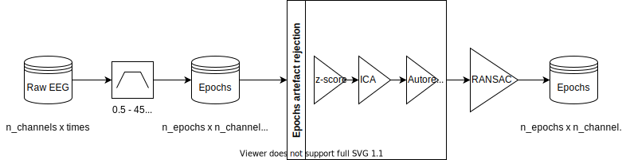

[](https://github.com/weiglszonja/eeg-preprocessing/actions/workflows/paper.yml)
[](https://github.com/weiglszonja/meeg-tools/actions/workflows/pylint.yml)
[](https://github.com/weiglszonja/meeg-tools/actions/workflows/black.yml)
[](https://github.com/weiglszonja/eeg-preprocessing/actions/workflows/testing.yml)
[](https://badge.fury.io/py/meeg-tools)
[](https://github.com/weiglszonja/eeg-preprocessing/blob/master/LICENSE)

 

In association with the Lyon Neuroscience Research Center (Lyon), Memo Team,
PI: [Dezso Nemeth](https://www.memoteam.org).

# meeg-tools

EEG/MEG data preprocessing and analyses framework


## Overview

The `meeg-tools` serves as a cookbook for preprocessing and analyzing EEG/MEG
signals in a semiautomatic and reproducible way. The general use-case of the
package is to use it from a Jupyter notebook. The
`tutorials` folder contains notebooks that demonstrate data operations
and transformations that are described in the Background section.

## Installation

Install the latest version from PyPI into an existing environment:

```bash
$ pip install meeg_tools
```

Since this project is under development, I would recommend installing it from
source in editable mode with pip:

```bash
$ git clone https://github.com/weiglszonja/meeg-tools.git
$ cd meeg-tools
$ pip install -e .
```

## Background

### Preprocessing




Electroencephalography (EEG) and magnetoencephalography (MEG) measures neural
activity of the brain. The signals that are recorded from multiple sensors are
inherently contaminated by noise. Preprocessing aims to attenuate noise in the
EEG/MEG data without removing meaningful signals in the process. Here, we
present a semiautomatic pipeline which can prepare the data for functional
connectivity or event related potential (ERP) analyses.

The meeg-tools package aims to serve as a semiautomatic and reproducible
framework for preprocessing EEG/MEG signals prior to time-frequency-based
analyses. It minimizes the manual steps required to clean the data based on
visual inspection and reduces the number of choices that depend on the
researcher for rejecting segments of data or interpolation of electrodes. This
package utilizes modules from mne-Python (Gramfort et al., 2013), a popular
open-source Python package for working with neurophysiological data. For
automated rejection of bad data spans and interpolation of bad electrodes it
uses the Autoreject (Jas et al., 2017) and the Random Sample Consensus (
RANSAC) (Bigdely-Shamlo et al., 2015) packages.

The general use-case of the package is to use it from a Jupyter notebook.
The `tutorials` folder contains notebooks demonstrating data operations such as
loading and writing the data along with the transformation steps that are
described below.

In order to remove high-frequency artefacts and low-frequency drifts, a
zero-phase band-pass filter (0.5 - 45 Hz) is applied to the continuous data
using mne-Python. This temporal filter adapts the filter length and transition
band size based on the cutoff frequencies. The lower and upper cutoff
frequencies can be changed in the configuration file (config.py) located at the
utils folder.

Subsequently, the filtered data is segmented into nonoverlapping segments (
epochs) to facilitate analyses. The default duration of epochs is one seconds,
however it can be changed in the configuration file.

The removal of bad data segments is done in three steps. First, epochs are
rejected based on a global threshold on the z-score (> 3) of the epoch variance
and amplitude range. To further facilitate the signal-to-noise ratio,
independent components analysis (ICA) is applied to the epochs. ICA is a
source-separation technique that decomposes the data into a set of components
that are unique sources of variance in the data. The number of components and
the algorithm to use can be specified in the configuration file. The default
method is the infomax algorithm that finds independent signals by maximizing
entropy as described by (Bell & Sejnowski, 1995), (Nadal & Parga, 1999).
Components containing blink artefacts are automatically identified using
mne-Python. The interactive visualization of ICA sources lets the user decide
which components should be rejected based on their topographies and
time-courses. The number of components that were removed from the data are
documented in the “description” field of the epochs instance “info” structure.
The final step of epoch rejection is to apply Autoreject (Jas et al., 2017) on
the ICA cleaned data. Autoreject uses unsupervised learning to estimate the
rejection threshold for the epochs. In order to reduce computation time that
increases with the number of epochs and channels, it is possibe to fit autoreject
on a representative subset of epochs (25% of total epochs). Once the parameters
are learned, the solution can be applied to any data that contains channels
that were used during fit.

The final step of preprocessing is to find and interpolate outlier channels.
The Random Sample Consensus (RANSAC) algorithm (Fischler & Bolles, 1981)
selects a random subsample of good channels to make predictions of each channel
in small non-overlapping 4 seconds long time windows. It uses a method of
spherical splines (Perrin et al., 1989) to interpolate the bad sensors.

Additionally, the EEG/MEG reference can be changed to a “virtual reference”
that is the average of all channels using mne-Python.

### Time-frequency analysis

The `tutorials` folder contains a jupyter notebook that demonstrates the usage
of some functions available in mne-Python for time-frequency analysis.

```bash
$ jupyter notebook tutorials/time_frequency_analysis_tutorial.ipynb
```

## Usage

The `tutorials` folder contains a sample jupyter notebook that demonstrates the
preprocessing pipeline.
See [this](https://mne.tools/stable/auto_tutorials/io/20_reading_eeg_data.html)
documentation about supported file formats.

```bash
$ jupyter notebook tutorials/preprocessing_tutorial_without_triggers.ipynb
```

## Tests

Run unittests from the terminal with:

```bash
$ python -m unittest
```

## Contribution

This project is under development; comments are all welcome and encouraged!
Suggestions related to this project can be made with opening an
[issue](https://github.com/weiglszonja/meeg-tools/issues/new)
at the issue tracker of the project. Contributions and enhancements to the code
can be made by forking the project first; committing changes to the forked
project and then opening a pull request from the forked branch to the master
branch of meeg-tools.


## References

Bell, A. J., & Sejnowski, T. J. (1995). An information-maximization approach to
blind separation and blind deconvolution. Neural Computation, 7(6), 1129–1159.
Bigdely-Shamlo, N., Mullen, T., Kothe, C.,

Su, K.-M., & Robbins, K. A. (2015). The PREP pipeline: standardized
preprocessing for large-scale EEG analysis. In Frontiers in Neuroinformatics (
Vol. 9). https://doi.org/10.3389/fninf.2015.00016

Fischler, M. A., & Bolles, R. C. (1981). Random sample consensus. In
Communications of the ACM (Vol. 24, Issue 6, pp. 381–395)
. https://doi.org/10.1145/358669.358692

Gramfort, A., Luessi, M., Larson, E., Engemann, D. A., Strohmeier, D.,
Brodbeck, C., Goj, R., Jas, M., Brooks, T., Parkkonen, L., & Hämäläinen, M. (
2013). MEG and EEG data analysis with MNE-Python. Frontiers in Neuroscience, 7,
267.

Jas, M., Engemann, D. A., Bekhti, Y., Raimondo, F., & Gramfort, A. (2017).
Autoreject: Automated artifact rejection for MEG and EEG data. NeuroImage, 159,
417–429.

Nadal, J.-P., & Parga, N. (1999). SENSORY CODING: INFORMATION MAXIMIZATION AND
REDUNDANCY REDUCTION. In Neuronal Information Processing (pp. 164–171)
. https://doi.org/10.1142/9789812818041_0008

Perrin, F., Pernier, J., Bertrand, O., & Echallier, J. F. (1989). Spherical
splines for scalp potential and current density mapping. Electroencephalography
and Clinical Neurophysiology, 72(2), 184–187.
